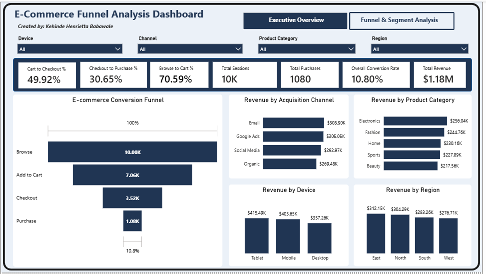

# E-Commerce Funnel & Revenue Analysis

## Project Overview

This project analyzes e-commerce customer behavior across the conversion funnel, from browsing to completed purchase.

The analysis focuses on customer conversion, funnel drop-off, revenue performance, and differences across devices, acquisition channels, regions, and product categories.

The project was conducted using Python for exploratory and statistical analysis and Power BI for interactive dashboard development.

---

## Objectives

The main objectives of this project were to:

- Analyze the e-commerce conversion funnel
- Calculate conversion and drop-off rates at each stage
- Identify the major bottleneck in the customer journey
- Compare conversion performance across customer segments
- Analyze revenue by product category, channel, device, and region
- Examine purchase-value distribution
- Develop an interactive Power BI dashboard
- Generate actionable business recommendations

---

## Tools & Technologies

- Python
- Pandas
- NumPy
- Matplotlib
- Seaborn
- Jupyter Notebook
- Power BI
- DAX
- Power Query

---

## Analysis Process

### 1. Data Preparation

The dataset was inspected and prepared for analysis, including data type validation and creation of relevant analytical fields.

### 2. Exploratory Data Analysis

The dataset was analyzed across:

- Event
- Device
- Region
- Channel
- Product Category
- Bounce Flag
- Revenue

### 3. Funnel Analysis

The customer journey was analyzed across four stages:

**Browse → Add to Cart → Checkout → Purchase**

Conversion and drop-off rates were calculated for each stage.

### 4. Segment Analysis

Conversion performance was compared across:

- Device
- Channel
- Region
- Product Category

### 5. Revenue Analysis

Revenue performance was analyzed across the same business dimensions, alongside average purchase value and purchase-value distribution.

### 6. Power BI Dashboard

The Python analysis was translated into an interactive Power BI dashboard containing KPIs, funnel analysis, revenue visualizations, conversion comparisons, and interactive slicers.

---

## Key Findings

### Funnel Performance

The analysis identified **Checkout → Purchase** as the major funnel bottleneck.

- Overall conversion rate: **10.80%**
- Browse → Cart conversion: **70.59%**
- Cart → Checkout conversion: **49.92%**
- Checkout → Purchase conversion: **30.65%**
- Checkout → Purchase drop-off: **69.35%**

### Device Performance

Tablet users recorded the highest overall conversion rate:

- Tablet: **11.52%**
- Mobile: **11.03%**
- Desktop: **9.85%**

Tablet users also generated the largest share of revenue at **35.32%**.

### Channel Performance

Email was the strongest acquisition channel:

- Conversion rate: **11.21%**
- Revenue contribution: **26.26%**

### Product Performance

Electronics generated the highest product-category revenue:

- Revenue: **256,035.81**
- Revenue contribution: **21.76%**
- Checkout → Purchase conversion: **33.38%**

### Regional Performance

East recorded the strongest overall regional performance:

- Conversion rate: **11.26%**
- Revenue contribution: **26.53%**

North had the highest average purchase value at **1,122.84**.

### Revenue

Total purchase revenue was:

**1,176,405.78**

Average purchase value:

**1,089.26**

Median purchase value:

**1,099.83**

---

## Business Recommendations

1. Investigate barriers at the **Checkout → Purchase** stage.
2. Investigate the relatively lower conversion performance among **Desktop users**.
3. Continue leveraging **Email** as a strong acquisition channel.
4. Maintain focus on high-performing categories such as **Electronics**.
5. Investigate lower-performing segments such as **Beauty** and **Organic traffic**.
6. Examine the factors contributing to stronger performance in the **East region**.
7. Monitor conversion and revenue KPIs continuously through the Power BI dashboard.

---

## Dashboard

### Executive Overview



### Funnel & Segment Analysis


---

## Project Structure

```text
ecommerce-funnel-analysis/
│
├── dataset/
├── python/
├── powerbi/
├── images/
└── README.md
