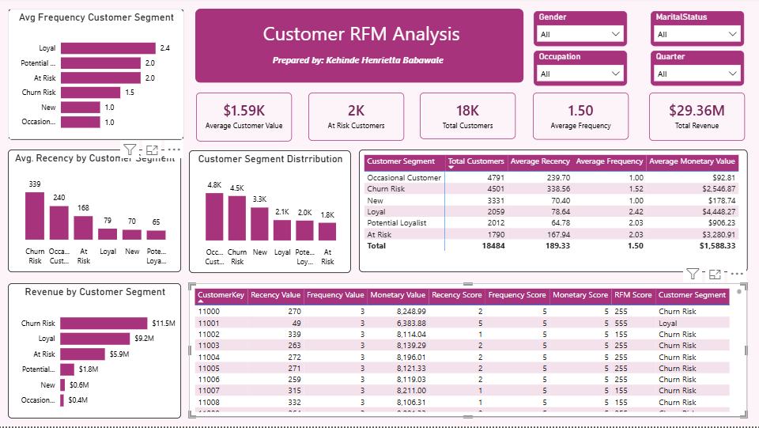

# Customer RFM Analysis & Segmentation Dashboard

## Project Overview

This project analyzes customer purchasing behavior using RFM (Recency, Frequency, Monetary) analysis in Microsoft Power BI.

The objective was to segment customers based on their purchasing behavior and identify high-value, at-risk, loyal, and churn-risk customer groups.

This project was completed as part of the Syntecxhub Virtual Internship Program.

---

## Objectives

- Analyze customer purchasing behavior
- Calculate Recency, Frequency, and Monetary values
- Assign RFM scores to customers
- Segment customers based on their RFM scores
- Identify high-value and at-risk customers
- Analyze revenue contribution by customer segment
- Develop an interactive Power BI dashboard
- Generate actionable customer retention recommendations

---

## Tools

- Microsoft Power BI
- DAX
- Power Query

---

## 🔍 Methodology

### 1. Data Preparation

The dataset was cleaned and transformed using Power Query before being loaded into Power BI.

Key preparation steps included:

- Data type validation
- Date field transformation
- Customer-level aggregation
- Removal/handling of inconsistent values
- Preparation of transaction data for RFM analysis

### 2. RFM Analysis

Three key customer metrics were calculated:

**Recency**

Measures how recently a customer made a purchase.

**Frequency**

Measures how frequently a customer made purchases.

**Monetary Value**

Measures the total amount spent by a customer.

### 3. RFM Scoring

Customers were assigned scores from 1–5 for:

- Recency Score
- Frequency Score
- Monetary Score

These scores were combined to generate an overall RFM score.

### 4. Customer Segmentation

Customers were grouped into behavioral segments based on their RFM scores.

The dashboard includes segments such as:

- Loyal
- Potential Loyalist
- At Risk
- Churn Risk
- New
- Occasional Customer

---

## Dashboard Features

The Power BI dashboard provides an interactive view of customer behavior through:

- Average Customer Value
- At Risk Customers
- Total Customers
- Average Frequency
- Total Revenue
- Customer Segment Distribution
- Average Recency by Customer Segment
- Revenue by Customer Segment
- Average Frequency by Customer Segment
- Average Monetary Value by Customer Segment
- Detailed customer-level RFM table

Interactive filters are also available for:

- Gender
- Marital Status
- Occupation
- Quarter

---

## Key Insights

The analysis identified several differences in customer behavior across the various segments.

### Customer Value

The dashboard reports an average customer value of approximately **$1.59K**, with total revenue of approximately **$29.36M**.

### Customer Segmentation

The largest customer groups are:

- Occasional Customers
- Churn Risk
- New Customers

This indicates that a significant portion of the customer base may require stronger retention and engagement strategies.

### Revenue Contribution

Churn Risk customers contribute approximately **$11.5M** in revenue, making this segment particularly important from a retention perspective.

Loyal customers contribute approximately **$9.2M**, highlighting the importance of maintaining relationships with existing high-value customers.

### At-Risk Customers

Approximately **2K customers** are classified as At Risk, creating an opportunity for targeted re-engagement campaigns.

---

## Recommendations

Based on the RFM analysis:

### Loyal Customers
- Introduce loyalty rewards
- Provide exclusive offers
- Encourage repeat purchases
- Develop VIP customer programs

### Potential Loyalists
- Encourage customers to purchase more frequently
- Provide personalized recommendations
- Offer incentives for repeat purchases

### At Risk Customers
- Launch targeted re-engagement campaigns
- Provide personalized discounts
- Recommend relevant products
- Monitor changes in purchasing behavior

### Churn Risk Customers
- Use win-back campaigns
- Offer targeted incentives
- Identify reasons for declining engagement
- Prioritize high-value churn-risk customers

### New Customers
- Develop onboarding campaigns
- Encourage second purchases
- Provide introductory offers
- Introduce loyalty programs early

---

## Dashboard Preview

---

## 📂 Repository Contents

| File | Description |
|------|-------------|
| `Customer_RFM_Analysis.pbix` | Power BI dashboard and analysis |
| `RFM_Analysis_Dashboard.png` | Dashboard preview |
| `README.md` | Project documentation |

---

## 🚀 Project Outcome

This project demonstrates the use of Power BI and DAX to transform customer transaction data into actionable customer segmentation insights.

The analysis can help businesses identify valuable customers, understand purchasing behavior, reduce customer churn, and develop targeted retention strategies.

---

## 👩🏽‍💻 Author

**Kehinde Henrietta Babawale**

Data Analytics | Power BI | Python | SQL | Excel

Completed as part of the **Syntecxhub Virtual Internship Program**.
